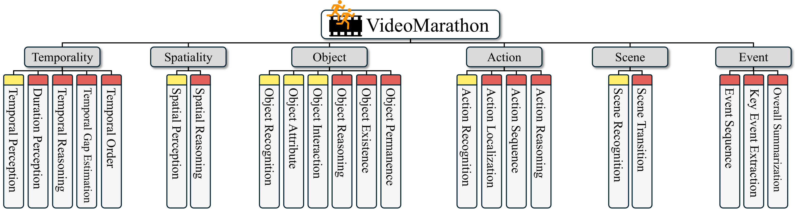
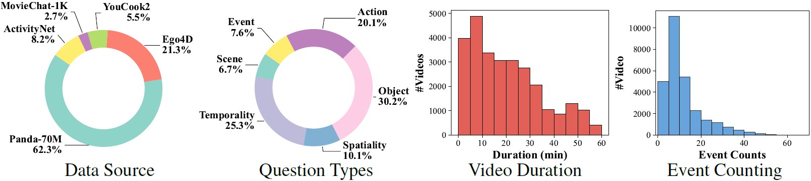
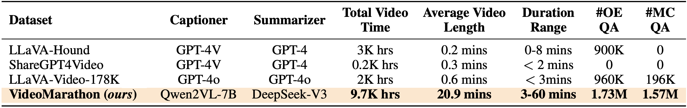
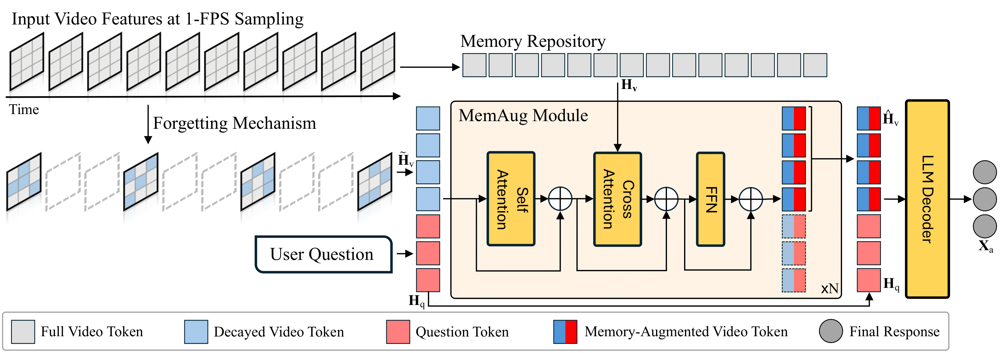

#  Unleashing Hour-Scale Video Training for Long Video-Language Understanding

[](https://videomarathon.github.io/)
[](https://arxiv.org/abs/2506.05332)
[](https://huggingface.co/datasets/jylins/videomarathon)
[](https://huggingface.co/collections/jylins/videomarathon-68407b3f9c80959fdfee5d7e)

<div>
  <a href="https://jylin.me/">Jingyang Lin</a><sup>1,2</sup>,
  <a href="https://jialianwu.com/">Jialian Wu</a><sup>1</sup>,
  <a href="https://cs-people.bu.edu/sunxm/">Ximeng Sun</a><sup>1</sup>,
  <a href="https://zewang95.github.io/">Ze Wang</a><sup>1</sup>,
  <a href="https://joellliu.github.io/">Jiang Liu</a><sup>1</sup>,
  <a href="https://yushengsu-thu.github.io/">Yusheng Su</a><sup>1</sup>,
  <a href="https://www.xiaodongyu.me/">Xiaodong Yu</a><sup>1</sup>,
  <a href="https://hhhhhhao.github.io/">Hao Chen</a><sup>1</sup>,
  <a href="https://www.cs.rochester.edu/u/jluo/">Jiebo Luo</a><sup>2</sup>,
  <a href="https://zicliu.wixsite.com/mysite">Zicheng Liu</a><sup>1</sup>,
  <a href="https://scholar.google.com/citations?user=bX1YILcAAAAJ">Emad Barsoum</a><sup>1</sup>
  <br>
  <sup>1</sup>AMD&emsp; 
  <sup>2</sup>University of Rochester&emsp; 
</div>

## News

- [2025.6] Release the Hour-LLaVA training code & Hour-LLaVA models.
- [2025.6] Release the VideoMarathon Dataset.

## Table of Contents
- [VideoMarathon Dataset](#-1-videomarathon-dataset)
- [Hour-LLaVA](#-2-hour-llava)
- [Requirements](#-3-requirements)
- [Installation](#-4-installation)
- [Training](#-5-training)
- [Acknowledgments](#-6-acknowledgments)
- [Citation](#-7-citation)

## 1 VideoMarathon Dataset
**VideoMarathon** is a large-scale long video instruction-following dataset with a total duration of approximately **9,700 hours**, comprising **3.3 million QA pairs** across **22 task categories**.
## 1.1 Task Taxonomy
The dataset contains 22 diverse tasks over six fundamental topics, including temporality, spatiality, object, action, scene, and event. These diverse tasks require both *short-form* (yellow tag) and *long-form* (red tag) video comprehension.

## 1.2 Data Statistics

- **Data Source**: The dataset spans diverse video source domains.
- **Question Type**: The dataset features a wide range of question types for long-form video-language modeling.
- **Video Duration**: The dataset consists of long videos ranging from three minutes to one hour.
- **Event Counting**: The dataset includes complex video content reflected by the number of events per video.

## 1.3 Data Comparison
The comparison between our VideoMarathon and other existing video instruction-following datasets shows that VideoMarathon features a significantly *longer average video length*, *broader duration range*, and *a larger number of QA pairs*.



## 2 Hour-LLaVA
Powered by memory augmentation, we propose Hour-LLaVA, an efficient video-language model capable of modeling hour-long videos at 1 FPS. It comprises three key modules: a video encoder, a memory augmentation module (i.e., MemAug), and an LLM decoder.


## 3 Requirements
- Python 3.10
- PyTorch == 2.1.2
- torchvision == 0.16.1
- transformers == 4.46.0
- flash-attention == 2.6.3

## 4 Installation
- Clone this repository:

  ```bash
  git clone https://github.com/jylins/hourllava.git
  cd hourllava
  ```

- Create a conda virtual environment and activate it:

  ```bash
  conda create -n hourllava python=3.10 -y
  conda activate hourllava
  ```

- Install the training package of Hour-LLaVA:

  ```bash
  pip install --upgrade pip
  pip install -e ".[train]"
  ```
  
- Install other requirements:

  ```bash
  git clone -b v0.11.1 https://github.com/jylins/streaming
  cd streaming
  pip install -e .
  ```


## 5 Training

### 5.1 Data Preparation

#### 5.1.1 Raw Data Download 
Due to copyright restrictions, we are unable to release the raw videos directly. Please follow the instructions below to download the videos from their respective sources.

For raw videos used in the VideoMarathon dataset:
- [Panda-70M](https://snap-research.github.io/Panda-70M/): Please download the videos using the URLs provided in the [VideoMarathon](https://huggingface.co/datasets/jylins/videomarathon) dataset.
- [Ego4D](https://ego4d-data.org/): Download the videos directly from the official website: [[link](https://ego4d-data.org/)].
- [MovieChat-1K](https://wenhaochai.com/MovieChat/): Please download the videos from the official HuggingFace repository: [Enxin/MovieChat-1K_train](https://huggingface.co/datasets/Enxin/MovieChat-1K_train).
- [ActivityNet](https://activity-net.org/): Please download the videos from this HuggingFace repository: [lmms-lab/ActivityNetQA](https://huggingface.co/datasets/lmms-lab/ActivityNetQA).
- [YouCook2](https://youcook2.eecs.umich.edu/): Please download the videos from this HuggingFace repository: [lmms-lab/YouCook2](https://huggingface.co/datasets/lmms-lab/YouCook2).

In addition, please download [LLaVA-Video-178K](https://huggingface.co/datasets/lmms-lab/LLaVA-Video-178K) and [LLaVA-OneVision](https://huggingface.co/datasets/lmms-lab/LLaVA-OneVision-Data) by following the official instructions provided in their respective HuggingFace repositories.

#### 5.1.2 Preprocessing Instruction-following data
For training efficiency, up to 5 QA pairs from the same VideoMarathon video are
grouped as a multi-turn conversation per training sample. Please download the processed instruction-following data from [videomarathon.json](https://drive.google.com/file/d/1-BAwlMTOPCGXRtBMmp9g7hmw5GlT-JG1/view?usp=sharing).

#### 5.1.3 Pre-Extraction of VideoMarathon Dataset

To accelerate the training process, we recommend pre-extracting video features from the VideoMarathon dataset.

For **Hour-LLaVA-3B**, run:
``` bash
bash scripts/embedding/hourllava_qwen25_3b_emb.sh
```

For **Hour-LLaVA-7B**, run:
``` bash
bash scripts/embedding/hourllava_qwen2_7b_emb.sh
```

#### 5.1.4 Conversion to Streaming Format
To enable the streaming data loader, we transform the raw dataset into the format supported by the [mosaicml/streaming](https://github.com/mosaicml/streaming/) repo:
- Image-Language Pretraining (Stage 1):
``` bash
bash scripts/sharding/scripts/sharding_llava_ov_si_onlyimg.sh
```
- Video-Language Adaptation (Stage 2):
``` bash
bash scripts/sharding/scripts/sharding_llavavideo_text.sh
bash scripts/sharding/scripts/sharding_llavavideo_si.sh
bash scripts/sharding/scripts/sharding_llavavideo_mi.sh
bash scripts/sharding/scripts/sharding_llavavideo_video.sh
```
- Video Instruction Tuning (Stage 3):
``` bash
bash scripts/sharding/scripts/sharding_videomarathon_video.sh
bash scripts/sharding/scripts/merge_hourllava_s3.sh
```

#### 5.1.5 File Structure of VideoMarathon dataset
```
data
├── VideoMarathon
│   ├── videos
│   │   ├── activitynet
│   │   ├── ego4d
│   │   ├── moviechat
│   │   ├── panda
│   │   └── youcook2
│   ├── features
│   │   ├── activitynet
│   │   ├── ego4d
│   │   ├── moviechat
│   │   ├── panda
│   │   └── youcook2
│   ├── jsons
│   │   └── videomarathon.json
│   └── sharding
│       ├── llava_ov_si_onlyimg_part0
│       ├── ...
│       ├── llavavideo_text_part0
│       ├── ...
│       ├── llavavideo_si_part0
│       ├── ...
│       ├── llavavideo_mi_part0
│       ├── ...
│       ├── llavavideo_video_part0
│       ├── ...
│       ├── videomarathon_video_part0
│       ├── ...
│       └── hourllava_s3
│           ├── 0
│           └── 1
├── LLaVA-Video-178K
└── LLaVA-OneVision
```

### 5.2 Training Scripts

#### 5.2.1 Stage 1: Image-Language Pretraining
To train **Hour-LLaVA-7B** for **image-language pretraining**, run:
```shell
bash scripts/hourllava/qwen2_7b/s1_image_language_pretraining.sh
```

To train **Hour-LLaVA-3B** for **image-language pretraining**, run:
```shell
bash scripts/hourllava/qwen25_3b/s1_image_language_pretraining.sh
```

#### 5.2.2 Stage 2: Video-Language Adaptation
To train **Hour-LLaVA-7B** for **video-language adaptation**, run:
```shell
bash scripts/hourllava/qwen2_7b/s2_video_language_adaptation.sh
```

To train **Hour-LLaVA-3B** for **video-language adaptation**, run:
```shell
bash scripts/hourllava/qwen25_3b/s2_video_language_adaptation.sh
```

#### 5.2.3 Stage 3: Video Instruction Tuning

To train **Hour-LLaVA-7B** for **video instruction tuning**, run:
```shell
bash scripts/hourllava/qwen2_7b/s3_video_instruction_tuning.sh
```

To train **Hour-LLaVA-3B** for **video instruction tuning**, run:
```shell
bash scripts/hourllava/qwen25_3b/s3_video_instruction_tuning.sh
```


## 6 Acknowledgments

This project builds upon the following open-source frameworks:
- **[LLaVA-NeXT](https://github.com/LLaVA-VL/LLaVA-NeXT)**: Open Large Multimodal Models
- **[flash-attention](https://github.com/Dao-AILab/flash-attention)**: The Official Implementation of FlashAttention and FlashAttention-2.

## 7 Citation
```bash
@article{lin2025unleashing,
  title={Unleashing Hour-Scale Video Training for Long Video-Language Understanding},
  author={Lin, Jingyang and Wu, Jialian and Sun, Ximeng and Wang, Ze and Liu, Jiang and Su, Yusheng and Yu, Xiaodong and Chen, Hao and Luo, Jiebo and Liu, Zicheng and others},
  journal={arXiv preprint arXiv:2506.05332},
  year={2025}
}
```